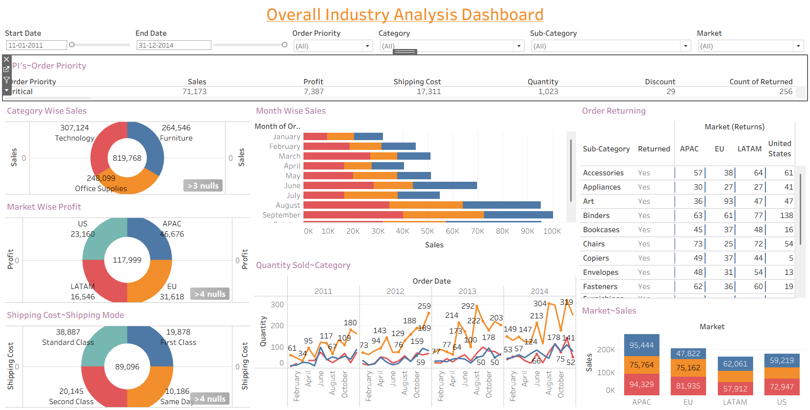
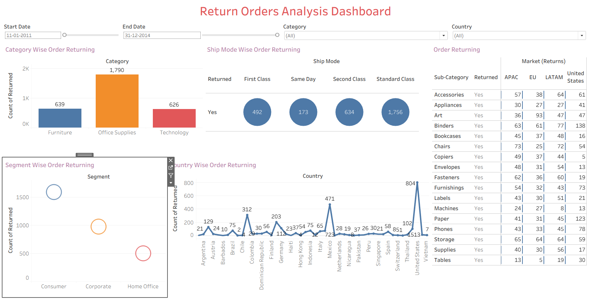

# 🌍 Global Superstore Sales & Return Analysis Dashboard (Tableau)

## 📌 Project Overview

This Tableau project provides an interactive analysis of Global Superstore sales performance and return orders. It enables business stakeholders to monitor sales, profit, shipping costs, customer segments, regional performance, and product returns to support strategic business decisions.

The project consists of two interactive dashboards:

- Overall Industry Analysis Dashboard
- Return Orders Analysis Dashboard

---

## 🎯 Business Problem

Retail businesses need to understand sales performance while also identifying the reasons behind product returns. This project combines revenue analysis with return order insights to help improve profitability, inventory planning, customer satisfaction, and operational efficiency.

---

## 📂 Dataset Information

The dataset includes:

- Orders
- Sales
- Profit
- Quantity
- Discount
- Shipping Cost
- Order Priority
- Customer Segment
- Product Category
- Sub-Category
- Market
- Country
- Return Status
- Ship Mode
- Order Date

---

## 🛠️ Tools & Technologies

- Tableau
- Microsoft Excel
- Data Visualization
- Business Intelligence

---

## 🚀 Skills Demonstrated

- Interactive Dashboard Design
- Sales Analysis
- Profitability Analysis
- Return Order Analysis
- Time Series Analysis
- Customer Segmentation
- Regional Performance Analysis
- Business Storytelling
- Data Visualization

---

# 📊 Dashboard 1 – Overall Industry Analysis

### Dashboard Features

- Sales by Category
- Profit by Market
- Shipping Cost by Ship Mode
- Monthly Sales Trend
- Quantity Sold Trend
- Market-wise Sales
- Order Priority Analysis
- Interactive Filters

### Key Insights

- Technology generated the highest overall sales among all product categories.
- APAC contributed the highest profit compared to other markets.
- Monthly sales trends reveal seasonal variations across the four-year period.
- Standard Class shipping accounted for the highest shipping cost.
- Market-wise sales comparison highlights regional business performance.

---

# 📊 Dashboard 2 – Return Orders Analysis

### Dashboard Features

- Category-wise Returns
- Segment-wise Returns
- Country-wise Returns
- Ship Mode Analysis
- Return Status by Sub-Category
- Interactive Date & Category Filters

### Key Insights

- Office Supplies experienced the highest number of returned orders.
- Consumer customers accounted for the largest share of product returns.
- Standard Class shipping had the highest number of returned orders.
- Return patterns vary significantly across countries and product categories.
- Return analysis helps identify opportunities to reduce operational losses.

---

## 💡 Business Recommendations

- Investigate products with consistently high return rates.
- Improve quality checks for frequently returned categories.
- Optimize shipping processes to reduce damages during transit.
- Focus marketing efforts on high-performing regions.
- Monitor seasonal sales trends for better inventory planning.
- Review return policies and customer feedback to reduce repeat returns.

---

## 💼 Business Value

This project helps business leaders monitor revenue performance while simultaneously identifying operational challenges related to product returns. The dashboards support data-driven decisions across sales, logistics, customer service, and inventory management.

---

## 🌐 Tableau Public Dashboards

### Overall Industry Analysis

https://public.tableau.com/app/profile/anshu.jain5590/viz/Learning-6AdvanceTableauSessions/Dashboard1?publish=yes

### Return Orders Analysis

https://public.tableau.com/app/profile/anshu.jain5590/viz/Learning-6AdvanceTableauSessions/Dashboard2?publish=yes

---

## 📷 Dashboard Preview

### Overall Industry Analysis

### Return Orders Analysis

---

## 📁 Files Included

- Global Superstore Dataset
- global-superstore-dashboard1.png
- global-superstore-dashboard2.png

---

## 👤 Author

**Anshu Jain**

Aspiring Data Analyst passionate about transforming business data into actionable insights using Power BI, Tableau, SQL, and Excel.
